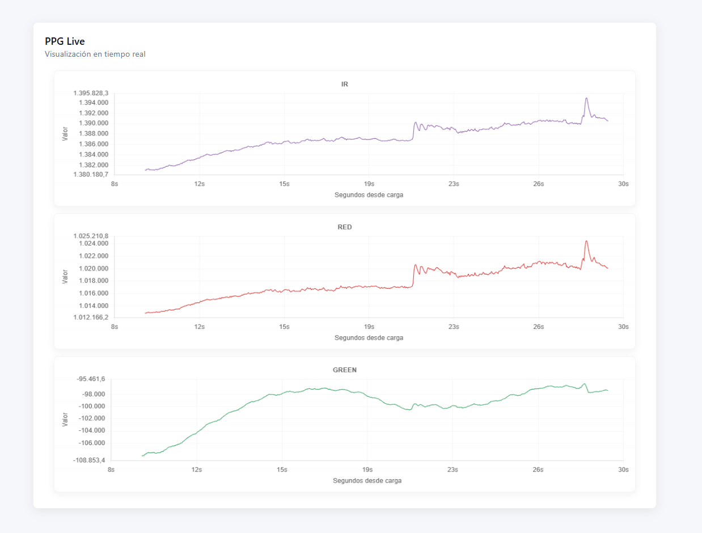

<!--
PPGDataReceiverAPI - README
Generated by GitHub Copilot assistant.
-->

# 🚀 PPG Data Receiver API

A lightweight collector and viewer for Photoplethysmography (PPG) streams  built to receive PPG data from smartwatches and other sources, broadcast it via WebSocket, and persist incoming data as CSV files for later analysis.

> Friendly, simple, and file-backed: send JSON to the backend, watch data live in the frontend, and keep CSV archives in the `data/` folder.

---

## 📚 Table of contents

- [What is this project?](#what-is-this-project)
- [Key features](#key-features)
- [Architecture](#architecture)
- [Repository layout](#repository-layout)
- [Data format](#data-format)
- [API & WebSocket](#api-websocket)
- [Frontend](#frontend)
- [Storing & CSVs](#storing-csvs)
- [Quickstart](#quickstart)
- [Manual (by-hand) setup](#manual-by-hand-setup)

---

<a id="what-is-this-project"></a>
## 🤔 What is this project?

This repo provides a simple backend that accepts PPG data (JSON) over HTTP, broadcasts incoming samples to browser clients via WebSocket, and saves each received batch into a timestamped CSV file. It also includes a minimal frontend that can connect to the WebSocket and display live PPG samples in a chart.

Use cases:

- Collect PPG export data from wearables or small devices.
- Replay/visualize data in a browser during testing or demos.
- Keep a CSV log of every received payload for offline analysis.

---

<a id="key-features"></a>
## ✨ Key features

- HTTP POST receiver for PPG JSON payloads (`POST /`).
- WebSocket endpoint (`/ws`) that broadcasts incoming data to connected clients.
- CSV storage: each POSTed batch is persisted in `data/` with a UTC timestamp prefix.
- Simple frontend to connect via WebSocket and plot data (vanilla JS).
- Delta-format support: backend can accept either absolute samples or delta-encoded arrays.

---

<a id="architecture"></a>
## 🏗️ Architecture

The backend is a small FastAPI app which:

- Accepts POST JSON payloads at `/` and converts them into a pandas DataFrame.
- Broadcasts the JSON/frames to WebSocket clients connected to `/ws`.
- Saves the DataFrame to the `data/` folder using a UTC timestamp prefix (`YYYY-MM-DDTHH-MM-SSZ_ppg.csv`).

Simple diagram:

```
[ device / smartwatch ] --HTTP POST JSON--> [ FastAPI backend ] --save--> data/*.csv
                                                |
                                                +-- WebSocket (/ws) --push--> [ frontend (browser) ]
```

---

<a id="repository-layout"></a>
## 📁 Repository layout

Key files and folders:

| Path | Purpose |
|---|---|
| `backend/main.py` | FastAPI app: HTTP POST `/` and WebSocket `/ws`. Uses `data.py` helpers. |
| `backend/data.py` | Utilities converting PPG JSON to pandas DataFrame and saving CSVs. Handles delta encoding. |
| `frontend/index.html` | Minimal UI to connect and display PPG streams. |
| `frontend/index.js`, `frontend/ws-client.js` | Frontend client and chart setup. |
| `data/` | Where incoming CSVs are stored. Example files present. |
| `requirements.txt` | Python dependencies for backend. |
| `start.sh`, `start.bat` | Convenience scripts to launch the backend (shell / PowerShell). |

---

<a id="data-format"></a>
## 🧾 Data format

The backend expects a JSON object containing PPG arrays. The primary keys are:

- `TIMESTAMP`  array of sample timestamps (used as DataFrame index).
- `RED`, `IR`, `GREEN`  arrays with sensor channel values.

The backend also accepts delta-encoded variants. If the payload uses delta-encoding the keys are suffixed with `_DELTA` (for example `TIMESTAMP_DELTA`, `RED_DELTA`). The server will convert delta arrays into absolute values before broadcasting or saving.

Examples (simplified):

```json
{
  "TIMESTAMP": [163... , 163..., ...],
  "RED": [12345, 12348, ...],
  "IR": [54321, 54325, ...]
}
```

Or delta-format:

```json
{
  "TIMESTAMP_DELTA": [1000, 10, 10],
  "RED_DELTA": [12000, 3, 2]
}
```

The backend function `ppg_dict_to_dataframe` (see `backend/data.py`) handles conversion and delta decoding.

---

<a id="api-websocket"></a>
## 🔌 API & WebSocket

- POST `/`  Accepts JSON body with PPG data. Returns `{"status": "ok", "received": true}` on success. The server will:
  - Convert JSON into a pandas DataFrame.
  - Broadcast the data to WebSocket clients (JSON orient=`split`).
  - Save the DataFrame to `data/<UTC-prefix>_ppg.csv`.

- WebSocket `/ws`  Connect with a browser or tool to receive live updates. The backend restricts connections to localhost for basic safety (only `127.0.0.1`, `::1`, or `localhost` are allowed).

Example curl to POST (replace `payload.json` with your data):

```bash
curl -X POST "http://localhost:8000/" -H "Content-Type: application/json" --data-binary @payload.json
```

Example WebSocket client (JS snippet):

```js
const ws = new WebSocket('ws://localhost:8000/ws');
ws.onmessage = (ev) => {
  const msg = ev.data;
  console.log('PPG update:', msg);
};

// To send from a device that speaks WebSocket (not required for HTTP-post flow):
ws.onopen = () => ws.send(JSON.stringify(yourPpgObject));
```

---


<a id="frontend"></a>
## 🖥️ Frontend

The `frontend/` folder contains a minimal UI built with plain JavaScript to connect to `/ws`, receive the broadcasted JSON frames, and render them into a chart. Files of interest:

- `frontend/index.html`  entry page
- `frontend/ws-client.js`  WebSocket client helper
- `frontend/chart-setup.js`  charting logic

You can adapt the frontend to your visualization stack (Chart.js, D3, etc.).



---

<a id="storing-csvs"></a>
## 💾 Storing & CSVs

Incoming POSTed payloads are converted into a pandas DataFrame and saved as CSV in the `data/` folder. Filenames use a UTC timestamp prefix, for example:

```
data/2025-11-17T01-25-09Z_ppg.csv
```

The CSVs can be loaded with pandas or any spreadsheet tool for offline analysis.
 
---

<a id="quickstart"></a>
## ⚡ Quickstart

Recommended: use the bundled `prepare.sh` script to create a virtual environment, install dependencies, and prepare the project, then start the app from the created environment. Take in consideration that Python is required — Python 3.9+ is recommended.

Run on Unix-like systems (bash / WSL / Git Bash):

```bash
./prepare.sh
source .venv/bin/activate
./start.sh
```

The `prepare.sh` script is idempotent and prints next steps after setup.

<a id="manual-by-hand-setup"></a>
## 🛠️ Manual (by-hand) setup

If you prefer not to use `prepare.sh` you can set up and run the project manually.

1. Create and activate a virtual environment

```bash
# create venv
python -m venv .venv
# activate (bash / WSL / Git Bash)
source .venv/bin/activate
```

2. Install dependencies

```bash
python -m pip install --upgrade pip setuptools wheel
python -m pip install -r requirements.txt
```

3. Run the backend

```bash
# development with reload
python -m uvicorn backend.main:app --host 0.0.0.0 --port 8000 --reload
```

Or use the provided start script:

```bash
./start.sh        # bash
```

4. Serve the frontend (optional)

```bash
cd frontend
python -m http.server 8080
# then open http://localhost:8080/
```

5. Send test data

```bash
curl -X POST "http://localhost:8000/" -H "Content-Type: application/json" --data-binary @payload.json
```

Notes:

- If you run the backend on a remote host, update the frontend WebSocket URL or allow the host in the backend CORS settings (`FRONTEND_PORT` environment variable influences allowed origins).
- The backend will save received batches to the `data/` folder as `YYYY-MM-DDTHH-MM-SSZ_ppg.csv`.
